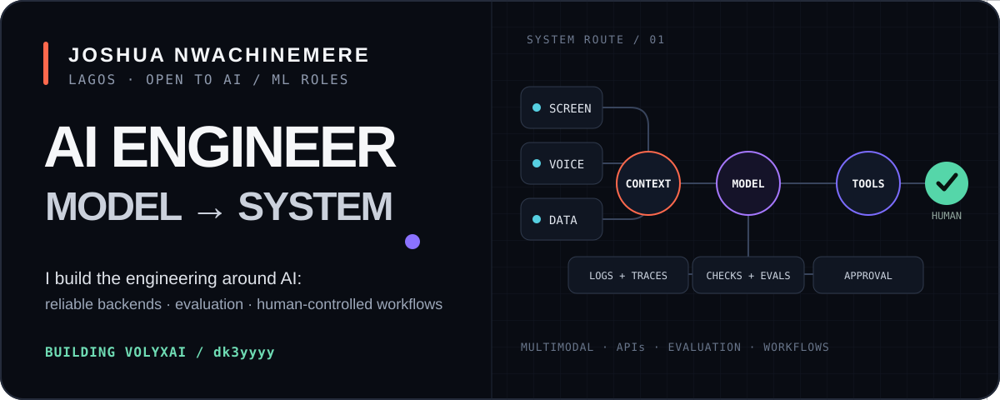

  

## About

I'm **Joshua Nwachinemere**, an AI engineer who builds practical systems around capable models: reliable backends, controlled workflows, evaluation, and interfaces people can actually use.

My public work spans multimodal assistants, API-driven data products, ML evaluation, real-time systems, and automation. **Python is my primary engineering language**, especially for AI systems, backend services, data workflows, and evaluation. For product surfaces outside my core stack, I use AI-assisted development while keeping system boundaries visible, testing behavior, and documenting decisions.

I'm also building [VolyxAI](https://volyxai.com), exploring focused workflows for intake, validation, approval, and handoff. It is one part of my engineering work—not the whole story—and consequential actions stay with people.

## Selected work

### [Volyx Lens](https://github.com/dk3yyyy/volyx-lens)

A privacy-oriented macOS AI assistant for screen, voice, meeting, and coding workflows. Built with Electron, JavaScript, and native Swift components, with provider routing, consent boundaries, tests, and a deliberately inspectable architecture.

`Electron` `JavaScript` `Swift` `AI APIs` `GitHub Actions`

### [Solana & Ethereum Wallet Analyzer](https://github.com/dk3yyyy/sol-eth-wallet-analyzer)

A read-only wallet analytics system combining asynchronous Python services, FastAPI, React/Vite, Telegram integration, and multiple blockchain data providers. The engineering work covers defensive API integration, portfolio data modelling, responsive product delivery, caching, and automated backend/browser verification.

`Python` `FastAPI` `React` `Vite` `Telegram` `Docker`

### [Noughtline](https://github.com/dk3yyyy/Noughtline) · [live preview](https://noughtline.onrender.com)

A real-time multiplayer game with authenticated guest sessions and server-authoritative state. The backend validates moves and rewards, handles reconnects and forfeits, and maintains a persistent two-currency economy with ledgered transactions.

`React` `Express` `Socket.IO` `SQLite` `Node.js test runner`

### [Football Predictor](https://github.com/dk3yyyy/football_predictor)

An evaluation-focused ML experiment covering automated data collection, feature engineering, XGBoost and Poisson models, chronological dataset splits, probability calibration, a FastAPI service, and a Streamlit interface. I use it to study pipeline design and honest evaluation rather than market it as a production forecasting service.

`Python` `XGBoost` `scikit-learn` `FastAPI` `Streamlit` `SQLAlchemy`

## Let's build something useful

I'm open to **AI Engineer** and **ML Engineer** opportunities.

[Portfolio](https://dk3yyyy.github.io/joshua-portfolio/) · [Email](mailto:josh0victor@outlook.com) · [LinkedIn](https://www.linkedin.com/in/joshua-nwachinemere/) · [VolyxAI](https://volyxai.com)

## Engineering focus

- **AI systems:** model integration, multimodal workflows, retrieval, and structured outputs
- **ML practice:** evaluation design, calibration, feature engineering, and classical ML
- **Backend:** FastAPI, REST APIs, webhooks, async Python, and service integration
- **Automation:** n8n, validation, approval gates, retries, and idempotency
- **Data and product delivery:** SQL, SQLite, API integration, and AI-assisted web interfaces
- **Shipping:** Docker, GitHub Actions, Playwright, testing, and Azure
