  <picture>
    <source media="(max-width: 480px)" srcset="./assets/volyx-terminal-mobile.svg" />
    
  </picture>

  <a href="https://dk3yyyy.github.io/joshua-nwachinemere/"><kbd>portfolio</kbd></a>&nbsp;
  <a href="mailto:josh0victor@outlook.com"><kbd>email</kbd></a>&nbsp;
  <a href="https://www.linkedin.com/in/joshua-nwachinemere/"><kbd>linkedin</kbd></a>&nbsp;
  <a href="https://github.com/dk3yyyy"><kbd>github</kbd></a>

## `❯ cat about.txt`

I build the retrieval, multimodal input, provider integration, evaluation, and backend reliability layers that turn model capability into useful systems.

- **`focus`** RAG, context engineering, multimodal/voice AI, structured outputs, and evals
- **`backend`** Python, FastAPI, asyncio, APIs, webhooks, caching, retries, and idempotency
- **`providers`** OpenAI, Anthropic, Gemini, DeepSeek, and Azure AI Foundry
- **`currently`** building VolyxAI and independently developing Volyx Lens
- **`status`** open to AI Engineer and ML Engineer opportunities

Python is my primary engineering language. My JavaScript and native product work is AI-assisted, with architecture, security boundaries, testing, and verification kept explicit.

## `❯ stack --list --verbose`

**`# AI & ML`**

<kbd>Python</kbd> <kbd>OpenAI</kbd> <kbd>Anthropic</kbd> <kbd>Azure AI Foundry</kbd> <kbd>Deepgram</kbd> <kbd>scikit-learn</kbd> <kbd>XGBoost</kbd>

**`# Backend`**

<kbd>FastAPI</kbd> <kbd>asyncio</kbd> <kbd>Node.js</kbd> <kbd>Express</kbd> <kbd>SQLAlchemy</kbd> <kbd>SQLite</kbd> <kbd>Socket.IO</kbd>

**`# Frontend / Apps`**

<kbd>React</kbd> <kbd>Vite</kbd> <kbd>Electron</kbd> <kbd>Swift</kbd> <kbd>JavaScript</kbd>

**`# Delivery / Automation`**

<kbd>Docker</kbd> <kbd>n8n</kbd> <kbd>GitHub Actions</kbd> <kbd>Playwright</kbd> <kbd>Azure</kbd>

## `❯ ls -la projects/`

### [`./volyx-lens`](https://github.com/dk3yyyy/volyx-lens)

<code>Electron · JavaScript · Swift</code>

> Privacy-oriented macOS assistant for screen, voice, meeting, and coding workflows. Includes provider routing, native capture components, Keychain-backed credentials, and explicit sharing controls. **[product site →](https://dk3yyyy.github.io/volyx-lens/)**

### [`./sol-eth-wallet-analyzer`](https://github.com/dk3yyyy/sol-eth-wallet-analyzer)

<code>FastAPI · React · Telegram</code>

> Read-only Solana and Ethereum analytics with bounded concurrency, caching, retries, partial-failure reporting, and automated API/browser verification. **[live demo →](https://chainscope-wallet-analyzer.onrender.com/)**

### [`./football_predictor`](https://github.com/dk3yyyy/football_predictor) `[experiment]`

<code>Python · XGBoost · FastAPI · Streamlit</code>

> Leakage-resistant chronological evaluation with out-of-fold stacking, calibrated XGBoost and Poisson models, frozen holdouts, and explicit artifact provenance. Across 1,140 untouched EPL test matches, it beat naive baselines but not normalized bookmaker closing probabilities.

<code>❯ ls projects/secondary</code>

 

**[`./telegram-social-video-downloader`](https://github.com/dk3yyyy/telegram-social-video-downloader)** 
<code>FastAPI · n8n · Telegram</code>

Self-hosted workflow with signed requests, replay protection, rate limits, isolated media processing, and explicit service boundaries.

**[`./Noughtline`](https://github.com/dk3yyyy/Noughtline)** 
<code>Node.js · Socket.IO · React</code>

Real-time multiplayer system with server-authoritative state, reconnect handling, one-time settlement, and a persistent transaction ledger. **[live preview →](https://noughtline.onrender.com/)**

## `❯ git log --merges --oneline upstream/`

- **`faststream`** restore FastAPI 0.140 dependency compatibility
- **`openai-agents-python`** retry pre-response WebSocket server errors
- **`calkit`** skip unrelated subproject checks for single-item runs

- [`ag2ai/faststream#2961`](https://github.com/ag2ai/faststream/pull/2961) adapted FastStream's dependency layer to FastAPI's slotted `Dependant` model while preserving AsyncAPI metadata and adding regression coverage.
- [`openai/openai-agents-python#3991`](https://github.com/openai/openai-agents-python/pull/3991) added bounded retry behavior and regression coverage for retryable and non-retryable WebSocket failures.
- [`calkit/calkit#1028`](https://github.com/calkit/calkit/pull/1028) fixed pipeline selection without weakening relevant validation.

Both changes were reviewed and merged upstream.

## `❯ contact --info`

- **`work with me`** AI engineering, ML engineering, model integration, and reliable automation
- **`email`** [josh0victor@outlook.com](mailto:josh0victor@outlook.com)

  <a href="https://github.com/dk3yyyy"><kbd>github.com/dk3yyyy</kbd></a>&nbsp;
  <a href="https://dk3yyyy.github.io/joshua-nwachinemere/"><kbd>portfolio →</kbd></a>&nbsp;
  <a href="https://www.linkedin.com/in/joshua-nwachinemere/"><kbd>linkedin →</kbd></a>&nbsp;
  <a href="mailto:josh0victor@outlook.com"><kbd>email →</kbd></a>

  <code>// built with intent. every system a decision.</code>

