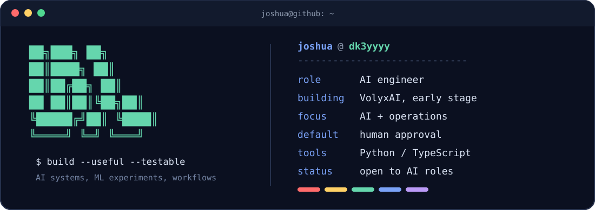

<p align="center">
  
</p>

## `whoami`

I'm Joshua Nwachinemere, an AI engineer and the founder of [VolyxAI](https://volyxai.com), an early-stage AI operations and workflow company.

I build backend services, ML experiments, and automations that connect models to real work. Most of my public code is Python, with JavaScript and TypeScript where the product needs a browser or a real-time interface. I care about systems people can inspect, test, and take over.

## What I'm working on

At VolyxAI, I'm designing controlled workflows for routine operations such as intake, validation, approvals, and handoffs. The company is early. The current focus is one useful workflow at a time, with people kept in the loop for consequential actions.

## Selected builds

### [Football predictor](https://github.com/dk3yyyy/football_predictor)

An end-to-end football prediction project with data scrapers, feature engineering, XGBoost models, a FastAPI service, and a Streamlit dashboard. It uses a multiclass outcome model, Poisson goal regressors, chronological train/calibration/test splits, and probability calibration. I do not publish an accuracy claim because the result depends on the data and evaluation window.

`Python` `XGBoost` `scikit-learn` `FastAPI` `Streamlit` `SQLAlchemy`

### [Local AI agent](https://github.com/dk3yyyy/local_AI_agent)

A small local retrieval experiment for asking questions about restaurant reviews. It embeds the review set with Ollama, stores vectors in Chroma, retrieves the five closest records, and sends that context to a local Llama 3.2 model.

`Python` `Ollama` `LangChain` `Chroma` `pandas`

### [Noughtline](https://github.com/dk3yyyy/tic_tac) · [live preview](https://noughtline.onrender.com)

A React, Express, Socket.IO, and SQLite game with authenticated guest sessions and server-authoritative multiplayer. The backend validates moves and rewards, handles reconnects and forfeits, keeps an immutable currency ledger, and credits verified Paystack references once.

`React` `Express` `Socket.IO` `SQLite` `Node.js test runner`

### [VirusTotal Telegram bot](https://github.com/dk3yyyy/VirusTotal-Telegram-Bot)

An async Telegram bot for scanning files, URLs, and hashes through the VirusTotal v3 API. It hashes files locally before upload, uses VirusTotal's large-file upload flow, backs off on rate limits, and keeps short-lived report caches for interactive detection details.

`Python` `Pyrogram` `aiohttp` `VirusTotal API`

## Working stack

```text
languages     Python · JavaScript · TypeScript · SQL
ai / ml       Ollama · LangChain · Chroma · XGBoost · scikit-learn · pandas
backend       FastAPI · Express · Socket.IO · REST APIs · webhooks
automation    n8n · approval gates · retries · idempotency
data          SQLite · SQLAlchemy
shipping      Docker · GitHub Actions · Azure
```

## Now

## Contact

[Email](mailto:josh0victor@outlook.com) · [LinkedIn](https://www.linkedin.com/in/joshua-nwachinemere/) · [VolyxAI](https://volyxai.com) · [GitHub](https://github.com/dk3yyyy)
